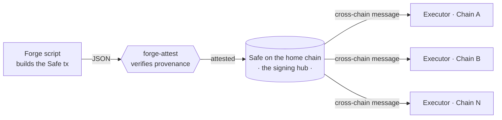

<picture>
  <source media="(prefers-color-scheme: dark)" srcset="https://raw.githubusercontent.com/crossecute/.github/main/brand/crossecute-icon-black.png" />
  
</picture>

**One multisig, on the chain you trust. Control on every other.**

---

## The idea

A protocol on many chains ends up running a separate multisig on each one. Every
one has its own signers, its own nonces, and its own signing steps. Each extra
place you sign is another place to get phished, send the wrong payload, or lose
quorum.

crossecute reduces that to one signing hub. A single [Safe](https://safe.global)
holds the authority. The actions it approves are carried to any destination chain
and run there. You sign once, on the chain you trust most, and the operation lands
everywhere.

You pick which chain that is. Ethereum is the expected anchor, and it is why most
people will read this as an Ethereum story. Nothing in the protocol requires it. A
team can centralize on whichever chain it is willing to anchor to, and every
destination is told which one at deployment.

The hard part is not the messaging. It is trusting what you sign. An operator
builds a transaction with a script in one repo and submits it to the Safe in
another. How does a signer know the thing in the queue is exactly what the script
produced, and was not changed on the way? That gap is where crossecute starts.

## Building blocks

| Repo | What it does | Status |
|------|--------------|--------|
| [**forge-attest**](https://github.com/crossecute/forge-attest) | Proves a submitted Safe transaction is byte for byte the output of a specific Forge script at a pinned commit. It reproduces the script, hashes the result three independent ways, and checks it against the live Safe queue. Chain-agnostic. | ✅ Available |
| [**forge-attest-example-safe-ops**](https://github.com/crossecute/forge-attest-example-safe-ops) | A reference producer repo: a deterministic Forge script that builds a Safe tx, verified by forge-attest. | ✅ Available |
| [**protocol**](https://github.com/crossecute/protocol) | The cross-chain executor. One owner holds the same address on every chain. The home-chain half sends; the half on every other chain receives and runs what arrives. Covers account creation, the approval queue, and both message paths. | 🚧 In progress |

## Principles

- **Do not trust, verify.** Every artifact can be rebuilt and checked by anyone.
  Provenance is worked out from the artifact, never asserted.
- **One signing surface.** Fewer multisigs, fewer nonces, fewer ways to be tricked.
- **The anchor is a choice, not a constant.** The home chain is a deployment
  parameter. Centralize where your trust already is.
- **Composable, not monolithic.** Each piece (provenance, execution, tooling)
  stands alone and is useful on its own.

## Status

Early. The verification layer is public and working. The routing layer is still
in development. Issues and questions are welcome on any repo above.
