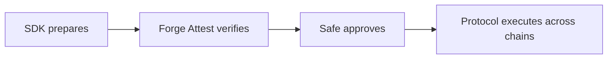

# crossecute

Run upgrades and other admin tasks across chains from one wallet, Safe, or DAO. Your team reviews and authorizes changes in one place.

```mermaid
flowchart LR
    SDK["SDK prepares"] --> Attest["Forge Attest verifies"]
    Attest --> Safe["Safe approves"] --> Protocol["Protocol executes across chains"]
```

- [Protocol](https://github.com/crossecute/protocol) sends instructions from your home chain and runs them on the destination chains.
- [SDK](https://github.com/crossecute/sdk) simulates the changes and prepares one Safe transaction for review.
- [Forge Attest](https://github.com/crossecute/forge-attest) reruns your script and checks that its output matches the transaction queued in Safe.

## Multichain multisig comparison

✅ Yes · ❌ No in the documented workflow

| Capability | crossecute | Chainlink MCMS | LayerZero OneSig | Candide Safe Unified Account |
| --- | --- | --- | --- | --- |
| Execute on multiple chains | ✅ | ✅ | ✅ | ✅ |
| One signing round for a multichain batch | ✅ | ✅ | ✅ | ✅ |
| One multisig deployed on a home chain only | ✅ | ❌ | ❌ | ❌ |
| Nested multisig contracts as signers | ✅ | ❌ | ❌ | ✅ |
| Automatic destination execution from a home-chain dispatch | ✅ | ❌ | ❌ | ❌ |
| Rerun a pinned script and verify the resulting transaction by hash | ✅ | ❌ | ❌ | ❌ |
| Use the standard Safe app and hosted signature queue | ✅ | ❌ | ❌ | ❌ |

- **crossecute** works with an existing Safe using standard Safe transactions. Teams can collect approvals through Safe's hosted queue. A compatible guard enables destination-side verification of nested Safe signatures. Automatic execution depends on the delivery route. [SDK guide](https://github.com/crossecute/sdk/blob/main/docs/usage.md) · [Safe queue](https://docs.safe.global/core-api/safe-queue-service-reference) · [Protocol docs](https://github.com/crossecute/protocol/blob/main/docs/README.md)
- **Chainlink MCMS** supports nested threshold groups of individual signers. Teams coordinate signing themselves and can add signatures to a proposal file with the SDK. Operators submit execution calls on the target chains. [Signer groups](https://github.com/smartcontractkit/ccip-owner-contracts#manychainmultisig-considerations) · [Signing](https://smartcontractkit.github.io/mcms/usage/signing-proposals/) · [Execution](https://smartcontractkit.github.io/mcms/usage/executing-proposals/)
- **LayerZero OneSig** uses a separate signature collection server in its reference workflow and also documents how to combine signatures locally. An executor submits the signed operation on each target chain. [OneSig protocol](https://github.com/LayerZero-Labs/onesig/blob/main/PROTOCOL.md)
- **Candide** uses AbstractionKit to sign multichain UserOperations. Each destination Safe verifies signatures, including contract signatures. Submission can use a hosted bundler or be done directly. [Signing](https://docs.candide.dev/wallet/abstractionkit/safe-account-signing/) · [Safe Unified Account architecture](https://github.com/candidelabs/safe-4337-multi-chain-signature-module/blob/main/ARCHITECTURE.md) · [Submission options](https://docs.candide.dev/wallet/guides/walkaway-guide/#bundler)
